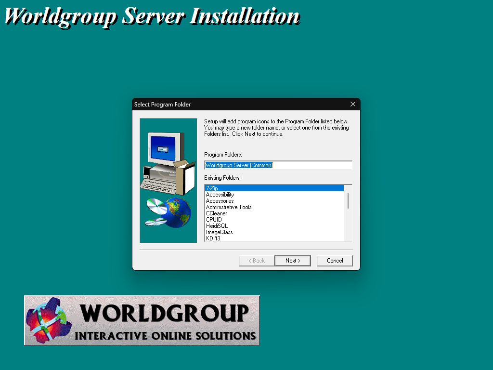
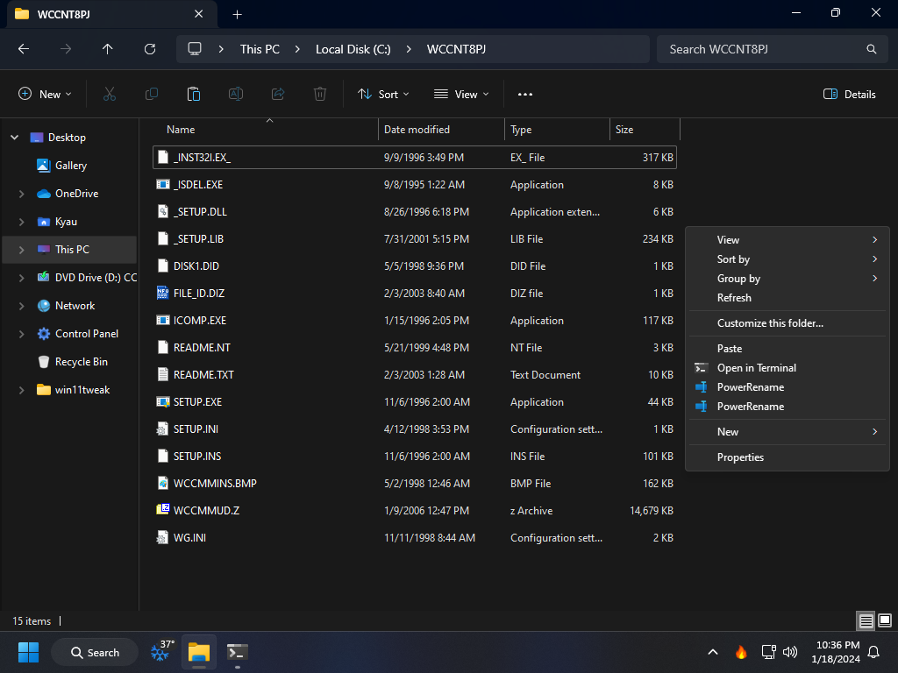
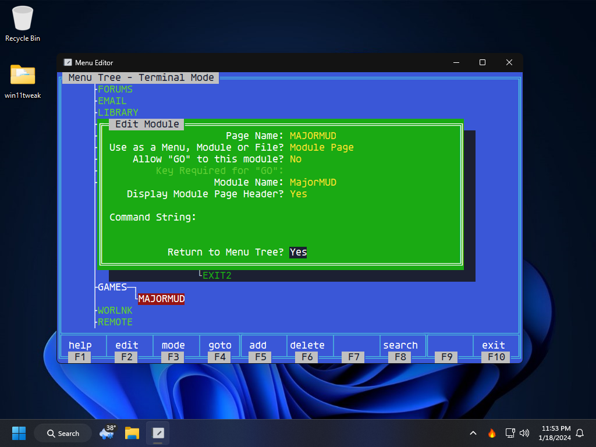

# MajorMUD


[](CODE_OF_CONDUCT.md) &nbsp; [](https://www.conventionalcommits.org/en/v1.0.0/) &nbsp; [](LICENSE) &nbsp; [](https://github.com/zricethezav/gitleaks)  
[](https://semver.org) &nbsp; [](https://discord.gg/DSvUNYm)

## Disclaimer

There is no doubt in stating that the glory days of the BBS are long dead and gone. It is the opinion of me and many others that all of the software and knowledge from this era of computing should now be made available in the public domain or at the very least as open source. That said while piracy is not condoned I must be honest in stating that without it, a lot of this stuff would have been lost forever.

```
🚧 WARNING
This repository is provided for archival/educational purposes, I am not responsible for any data loss or
damage that may ensue.
```

* [Introduction](#introduction)
* [Operating System](#operating-system)
* [Worldgroup Server Installation](#worldgroup-server)
* [Setup Wizard](#setup-wizard)
  * [System Information](#system-information)
  * [Sysop Information](#sysop-information)
  * [Accounting Model](#accounting-model)
  * [New Sign-up E-mail](#new-sign-up-e-mail)
  * [Channel Types](#channel-types)
  * [TCP/IP Configuration](#tcpip-configuration)
  * [Worldgroup Manager Packaging Utility](#worldgroup-manager-packaging-utility)
* [MajorMUD Installation](#majormud-installation)
  * [Hex Edits](#hex-edits)
  * [Newhaven & Silvermere Signs](#newhaven--silvermere-signs)
* [Configuration](#configuration)
  * [Menu Editor](#menu-editor)
  * [Security & Accounting](#security--accounting)
  * [Disable Modules](#disable-modules)
  * [General Setup](#general-setup)
* [Attribution](#attribution)

## Introduction

This repository consists of two parts, the first is a step-by-step guide on how to setup and install Worldgroup and MajorMUD; the second is a set of PHP scripts aimed at giving the Sysop direct access to Worldgroup's and MajorMUD's Btrieve databases.

Before getting started there are some prerequisites that need to be met.

## Operating System

While selecting an operating system (OS) use to make a huge difference and many people would only recommend something such as Windows XP. Nowadays things have changed drastically and you should **by no means** run an older OS unless specifically necessary. There are too many secondary security concerns when opening an older OS up to the internet which will not be covered here.

That said, you may choose Windows 10 or Windows 11. For future proof reasons this guide will be under the assumption that you have chosen Windows 11[^1].

[^1]: If you need assistance setting up Windows 11, reference [kyaulabs/win11tweak](https://github.com/kyaulabs/win11tweak)

## Worldgroup Server Installation

Begin by inserting and/or mounting the Worldgroup CD/ISO.

Open the Worldgroup Server keygen, choose any registration number click generate.

```
📌NOTE
Keep track of the registration number and the activation code somewhere. They will be utilized on 
multiple occasions.
```


Run the `SETUP.EXE` located in the Worldgroup installation folder on the removable disk. Click `Next >`.


Accept the Worldgroup Server License Agreement with `Yes`.

When prompted to Register Worldgroup Server enter in your `Name` and `Company` name along with the activation code you generated previously. Click `Next >`.


For the installation location using the default folder is your best option.

If however you choose to select a seperate folder it is advised that you keep the path to an [8.3 filename](https://en.wikipedia.org/wiki/8.3_filename).[^2] Click `Next >`.


After installation Worldgroup will prompt to update Active HTML files, this is only of concern if you are upgrading from a previous version. Click `Next >`.

```
📌NOTE
If you are upgrading from a previous version it is recommended to select 'Report Differences'
so that the upgrade does not overwrite any of your current Active HTML.
```


The installation will prompt to add Worldgroup to the system startup, allowing it to start automatically everytime you boot up Windows. Choose the option you prefer and click `Next >`.


Finally the setup will prompt for the name of the program folder to put in the start menu. Click `Next >`.



The `ACTHLOG.TXT` that opens is the log from the Active HTML update talked about previously. Again if you are not upgrading Worldgroup go ahead and just close this.

It should have also opened the programs folder that was created.


Finally the install will prompt if you would like to read the Worldgroup Release Notes upon exiting the installation. Click `Finish`.


## Worldgroup Setup Wizard

The install will state how it is about to run `WGSINT.EXE` upon exiting. Click `OK`.

Keep in mind that anything set here can always be modified later through the BBS configuration software.

The Worldgroup Setup Wizard will launch. Click `Next >`.


### System Information

Keeping note that this information will be publicly displayed on your BBS by default. Fill in all of your system information, when finished click `Next >`.


### Sysop Information

Enter in your Sysops information, it is important here that at the very least you modify the password at the bottom. Click `Next >`.


### Accounting Model

Typically there are little reasons to run anything but the `Public` accounting model. However if you would like an invite-only type atmosphere you can try `Sign-up`. Click `Next >` once you have decided.

```
📌NOTE
While it is perfectly acceptable to run the Private model, it is usually easier to just refuse
external internet access with a firewall.
```


### New Sign-up E-mail

By default, every new user of the BBS will get a greeting e-mail from the Sysop after signing up for an account, the BBS will then also send a notification e-mail to the Sysop containing information about the new sign-up.

The first part is for determining if you want to notify management of new users and who to send these to (sent to the Sysop by default).

The second part determines whether or not to send a greeting e-mail to new users and which account these e-mail should come from (the `From:` field).

Determine your values and then click `Next >`.


### Channel Types

Unless you are in the rare situation of still setting up a BBS with an actual modem and phone line or better yet serial connection (neither of which will be addressed in this guide), leave this set to `TCP/IP`. Click `Next >`.


### TCP/IP Configuration

The Server IP Address of the BBS should be set to your local IP address if you have a router that manages your internet (which will be most cases). For most people your IP address will be a variant of `192.168.1.X`, but as long as you are in the range of `10.0.0.0/8` or `192.168.0.0/16` you have selected the right IP.

If your local IP address is not automatically detected you can run `cmd /k ipconfig /all` to find it.

DNS Server IP Address is only required if you want to do any outbound TCP/IP with your BBS, set this to a DNS server of your choosing. If you do not know of a public DNS offering feel free to choose one of the following:

| Provider | Primary DNS | Secondary DNS |
|:-------- |:----------- |:------------- |
| Google | 8.8.8.8 | 8.8.4.4 |
| Control D | 76.76.2.0 | 76.76.10.0 |
| Quad9 | 9.9.9.9 | 149.112.112.112 |
| OpenDNS Home | 208.67.222.222 | 208.67.220.220 |
| Cloudflare | 1.1.1.1 | 1.0.0.1 |
| CleanBrowsing | 185.228.168.9 | 185.228.169.9 |
| Alternate DNS | 76.76.19.19 | 76.223.122.150 |
| AdGuard DNS | 94.140.14.14 | 94.140.15.15 |

Hostname and domain name should be set to what you plan on using. If you do not have a domain you may set this to anything you like.

When finished, click `Finish`.


[^2]: While Worldgroup itself supports long filenames a lot of the modules do not so it is advised to stick with the older format.

### Worldgroup Manager Packaging Utility

Since Worldgroup Manager (the graphical BBS client) is now a thing of the past and only serves to open up security issues there is no reason to launch this utility. Click `No`.


Congratulations! Worldgroup is now installed.

## MajorMUD Installation

```
📌NOTE
Given that the MajorMUD installation is based on a 16-bit version of InstallShield an alternate
method of installation will be used.
```

Copy or extract the installation folder onto your hard drive and open the folder in explorer. Right-click on the white-space in the folder and choose `Open in Terminal`.



To decompress all files (including sub directories) from `WCCMMUD.Z` to `C:\WGSERV` execute `.\ICOMP.EXE WCCMMUD.Z C:\WGSERV\*.* -d -i`.


Once extraction is complete, use `exit` to close the terminal.


Head into the `C:\WGSERV` folder and extract all of the following into the same folder:

`WCCHSE.ZIP` `WCCEMB.ZIP` `WCCBAN.ZIP` `WCCSTA.ZIP` `WCCSTO.ZIP`

### Hex Edits

If are planning on applying any of the [hex edits](https://github.com/kyaulabs/majormud/wiki/Hex-Edits-&-Tweaks) available, now would be a good time.

### Newhaven & Silvermere Signs

If you would like to customize the text on the signs at the center of town, use the files `NEWHAVEN.TXT` and `SILVRMRE.TXT`. These files will need to be created as they do not exist by default in the `C:\WGSERV` folder.

## Configuration

### Menu Editor

Launch the Worldgroup Menu Editor via `C:\WGSERV\wgsrunmt.EXE` (you may also want to make a shortcut on your Start Menu). You will likely see a message about extracting the rest of the custom descriptions for MajorMUD. Since will fail anyway due to the unzip executable that is included being 16-bit just press any key.

```
📌NOTE
We will take note of these ZIP files for later extraction
```


The menu editor will look a bit janky using the newer console in Windows 11. This can be remedied by clicking on the icon in the top left of the window and selecting `Properties`. Make sure `Use legacy console (requires relaunch, affects all consoles)` is checked at the bottom them click on `OK`. Once back in the Menu Editor press `<ESC>` to close out of it so you can relaunch it.


Upon relaunch the editor should function properly, with the `TOP` menu page selected press `<F2>` to edit it. Scroll down below the 11th menu option and add another option by pressing `G`. Give it a short description of `Games` and destination page of `GAMES` then press `<ENTER>` on `Yes` at the bottom to save your changes and return to the menu.


Scroll all the way down to the bottom of the Edit Menu window and select `Return to Menu Tree?` make sure it says `Yes` and press `<ENTER>`.

Back at the main screen, scroll down to find your new `GAMES` entry then press `<F2>` to open edit.


Press `<ENTER>` to confirm this is a `Menu Page`. Scroll down and set the `Page Title` to `Games`.

With the games menu created now scroll down to the first option available to the menu. Add an entry by pressing `M` (we will use M for MajorMUD). Give it a short description of `MajorMUD` and destination page of `MAJORMUD` then press `<ENTER>` on `Yes` at the bottom to save your changes and return to the menu.


Scroll all the way down to the bottom of the Edit Menu window and select `Return to Menu Tree?` make sure it says `Yes` and press `<ENTER>`.

Back at the main screen, press the right arrow on the `GAMES` entry to get to the `MAJORMUD` entry then press `<F2>` to open edit.

This time select `Module Page` and press `<ENTER>`. Scroll down to the `Module Name` which will open a list of modules to choose from, select MajorMUD. Finally navigate down to `Return to Menu Tree?` and choose `Yes` and press `<ENTER>`.



Once back at the Menu Tree press `<F10>` to save and exit.

### Security & Accounting

First start by launching the `KEYGEN.EXE` that goes with MajorMUD and select option `1` to generate the MajorMUD code. It will first ask how many users you would like the code to be for, make sure this is `256`. Then it will prompt you for your BBS registration number, this is the same one generated in the very first step of the Worldgroup installation.

Press `2` to generate a MajorMUD Plus code, confirming your same reg#.

Finally select option `4` to auto generate all module codes at once, again confirming your reg#.

```
📌NOTE
Write down the MajorMUD and MajorMUD Plus codes, the module ones will be put into a file in the
directory with the key generator.
```


Move the `wccmdact.ini` that the keygen created into the `C:\WGSERV` folder.

Launch `Security & Accounting` and scroll down to the MajorMUD section and enter in your activation codes for MajorMUD and MajorMUD Plus.


Also make the following changes to the `MajorMUD` section, this will get MajorMUD working for all users without requiring you to manage user groups and keys via the BBS.

| Name | Value |
|:---- |:----- |
| `SAVEKEY` | DEMO |
| `NODMOKEY` | DEMO |
| `NOPAYKEY` | DEMO |

Click the `Save` button and then exit.


### Disable Modules

Launch the `Offline Utilities` and select `WGSDMOD` to disable/enable modules then click `Run`.


Below on the left is a list of all of the required modules to run a minimal BBS that supports MajorMUD alone, to the right is a list of optional modules that can enhance your BBS but are not required. All other modules should be disabled for security purposes.

| Required | Required | Optional |
|:-------- |:-------- |:-------- |
| Account Display/Edit | MajorMUD | File Libraries |
| Data Entry Service | MajorMUD Plus | Invisibility Monitor |
| Editor | Message Center | Logon Notices |
| Electronic Mail | Offline Cleanup & Events | |
| File Transfer Service | Registry of Users | |
| Finger Server | Remote Sysop Menu | |
| Formatted Text Handler | TCP/IP for Worldgroup | |
| Forums | Telnet Server | |
| Gcomm Messaging Engine | Text Variables | |
| Logoff (end session) | The English/RIP language | |
| Main Executive | | |
When finished, use `<ALT>+<X>` to exit. Back at the Offline Utilities click `Exit`.


### General Setup

## Attribution

* [Worldgroup + Majormud Setup](https://www.mudinfo.net/viewtopic.php?t=1170)
* [ForumsHQ](https://web.archive.org/web/20050907001744/http://mmb.forumshq.com/)
* [Madis Kaal's Btrieve page](https://www.nomad.ee/btrieve/index.shtml)
